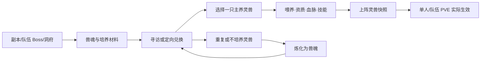

# 灵兽系统重构：功能设计文档

> 文档版本：v1.0 ｜ 状态：待评审 ｜ 适用项目：问道诸天 QQ 机器人
>
> 本设计参考《一念逍遥》公开的灵兽系统结构：灵兽可通过兽魂获取、围绕境界/血脉/技能/资质成长、上阵共同战斗，且灵兽园承担培养入口。[官方洞府与灵兽园介绍](https://xian.leiting.com/news/3.html) [官方灵兽化形说明](https://xian.leiting.com/news/787.html) 本项目只吸收该设计范式，不复用原作的角色、美术、道具名、数值或商业化规则。

## 1. 背景与问题

当前 P1 灵兽已具备“副本完成后每日寻访、收藏容量、单只出战、基础灵契与本源协同”的闭环，但灵兽只有一个 `aptitude` 数值和固定被动：

- 获得重复灵兽后没有明确用途，收藏上限很快成为阻塞；
- 资质、羁绊经验未形成可见的养成目标；
- 战斗只注入长期属性 Buff，缺少灵兽在回合中的存在感；
- 灵兽园只提供容量，尚未和洞府生产、坊市、副本掉落形成经济循环；
- 页面同时展示所有信息，无法在 QQ 文本交互中快速做出“培养哪只、材料够不够、上阵是否生效”的判断。

重构目标是将灵兽变成**一只主养、若干收集、稳定可成长、可解释可回退**的 PVE 伙伴系统；不将其做成付费抽卡或无上限随机数值竞赛。

## 2. 设计目标与边界

### 2.1 目标

1. **十分钟看懂**：玩家在“灵兽”页面能看到上阵、战力贡献、下一步可做的培养操作。
2. **一个月可养成**：任一常规玩家可稳定完成一只灵兽的主线培养，材料主要来自副本、洞府和周常。
3. **有选择而非有陷阱**：攻击、防护、回复、干扰四条战斗定位各有场景；培养可重置，重置返还大部分材料。
4. **战斗真实生效**：灵兽的属性、被动、技能在单人副本和队伍副本中使用同一份冻结快照；开战后改面板不影响当前场次。
5. **数据安全**：所有消耗、炼化、升级、上阵均在同一事务中校验并记录流水；重复 Webhook 不可重复扣除或领奖。

### 2.2 不做什么

- 首发不加入灵兽 PVP、玩家间灵兽交易、繁殖/合成随机变异和跨服排行。
- 首发不让灵兽拥有独立血条、独立行动指令，以免 QQ 回合战斗被额外操作拖慢。
- 首发不售卖灵兽本体、资质直升或战斗强度；商城只提供有限、可由玩法产出的辅助材料。
- 不改变已有角色基础属性表；灵兽效果只写入战斗快照。

## 3. 核心体验与循环

日循环：完成副本获得灵息/兽魂碎片 → 喂养或每日寻访 → 上阵打下一场副本。

周循环：队伍 Boss、周常委托产出血脉和技能材料 → 升级一个关键节点 → 通过炼化积累定向兑换资源。

## 4. 灵兽内容与定位

### 4.1 首发图鉴

保留现有四只灵兽及其玩家实例，不改 `beast_id`；新增三只原创模板，首发共七只。每种灵兽同名模板的**基础定位相同**，个体差异来自三维资质和培养进度，不采用稀有度抽卡。

| 定位 | 灵兽 | 元素 | 战斗职责 | 固有灵契（首发） |
| --- | --- | --- | --- | --- |
| 输出 | 赤焰灵狐 | 火 | 单体压血线 | 主人释放火系攻击后，附加一次低倍率灼烧 |
| 护法 | 玄甲龟 | 土 | 护盾、减伤 | 开场获得护盾；低血量时额外减伤一次 |
| 灵医 | 青木鹿 | 木 | 持续回复、净化 | 每 2 回合回复并优先净化一个可净化减益 |
| 扰敌 | 寒翎雀 | 水 | 先手、减速 | 首回合施加迟滞，提升队伍先手权重 |
| 输出 | 雷角貔貅 | 雷 | 追击、破防 | 敌人护盾被击破后触发一次追击 |
| 护法 | 云纹猿 | 金 | 承伤、反击 | 受到高伤害时给主人短暂防御提升 |
| 灵医 | 月影灵鲤 | 水 | 回能、续航 | 首次法力不足时回复少量法力，每场一次 |

**原则**：元素是技能联动标签，不直接克制；首发只允许白名单机制（伤害、护盾、减伤、治疗、净化、速度、法力、灼烧、破防）。任何文本描述都不能动态解释成战斗逻辑。

### 4.2 个体面板

每只灵兽展示且仅展示以下可影响决策的数据：

- 境界：`灵幼 → 灵启 → 灵化 → 灵相 → 灵尊`，由喂养经验升级；决定生命/攻击/防御基础系数与技能等级上限。
- 三维资质：气血、攻击、防御，各 0–100；总资质显示为 0–300。初始值为 45–65，使用资质丹稳定提升，单项达到 80 后改为小概率 +1 且设硬上限 100。
- 血脉：`凡品 0–5 → 灵品 0–5 → 玄品 0–5 → 天品 0–5`；每一小阶提供固定系数，整品解锁被动强化或外观称号。
- 技能：1 个天赋灵契 + 最多 2 个可培养技能（第 2 格在灵化解锁）；技能只升级效果，不洗随机词条。
- 羁绊：0–10 级，随携带完成副本增长；只提供小幅功能便利（图鉴文案、炼化返还、自动推荐），不参与硬战力。

采用多维资质、境界、血脉、技能的分层做法，来自同类灵兽系统的成熟结构；《一念逍遥》公开资料也明确了灵兽的资质、血脉、技能与境界维度。[玩法资料](https://www.taptap.cn/moment/357851010795833861) [官方系统优化说明](https://xian.leiting.com/news/702.html)

## 5. 养成规则与数值护栏

### 5.1 境界与喂养

- 消耗“灵兽口粮”（副本药材、炼丹副产物转化）获得喂养经验；不同材料仅影响经验，不引入随机失败。
- 每日有效喂养经验设软上限：达到后仍可喂养但按 30% 经验结算，避免囤积一次碾压。
- 境界每升一级只提升灵兽本体系数；跨大境解锁技能槽、血脉上限和外观称号。

### 5.2 资质

- `饲灵丹`：选择气血/攻击/防御目标，前 80 点必定 +1；80–100 点每次有 25% 概率 +1，失败给 1 点“灵韵”，4 点灵韵保底 +1。
- `洗髓露`：重置三维资质到同总资质的可分配点数，返还 80% 已消耗饲灵丹，不允许降低总资质。
- 首发资质提供的灵兽面板增益上限为角色对应属性的 12%；血脉、技能另行计算且不得突破每类上限。

### 5.3 血脉

- 消耗同名“精魄”或通用“兽魄”进行激活；每 5 小阶为一品。
- 每品效果：1–4 阶分别提高灵兽效果 2%，第 5 阶解锁一个固定强化（如“护盾持续 +1 回合”），不出现随机词条。
- 精魄来自队伍 Boss、周常和定向兑换；不可直接用灵石无限购买。

### 5.4 技能

| 类别 | 数量 | 获取 | 效果边界 |
| --- | ---: | --- | --- |
| 天赋灵契 | 1 | 灵兽模板固有 | 不可替换，随境界自动增强 |
| 战斗技能 | 1–2 | 技能残页定向兑换 | 自动触发，每场有限次数 |
| 协同技能 | 0–1 | 血脉天品解锁 | 与角色元素/本源/队伍状态联动 |

- 技能升级消耗“伴兽草”与灵石；每级增长固定，技能等级不超过灵兽境界许可。
- 战斗技能写成结构化配置，例如 `trigger=owner_cast_fire`、`effect=burn`、`max_trigger=1`，禁止在数据库保存 Python 表达式或自由脚本。
- 每只灵兽每回合最多触发 1 个自动效果、每场最多触发 3 个主动型效果；这是一条引擎护栏，防止多 Buff 连锁拖慢战斗。

### 5.5 炼化、还原与定向兑换

- 玩家可锁定灵兽；锁定、上阵、正在队伍战斗快照中的灵兽不可炼化。
- 炼化非锁定灵兽，获得 `兽魄 = 20 + 境界经验折算 × 80% + 血脉精魄折算 × 80%`；不返还已使用的技能残页。
- 兽魄可在“灵兽仙师”定向兑换任一已解锁图鉴的兽魂碎片和通用精魄；兑换价格固定且在页面展示。
- 还原仅针对资质/血脉/技能的培养，不删除灵兽；需二次确认口令 `确认还原 灵兽编号`。

这保留了“低价值灵兽可转化为下一只培养资源”的收集循环，同时避免反复刷初始资质的挫败感。

## 6. 获取、资源与经济

| 资源 | 主要来源 | 主要消耗 | 频率/限制 |
| --- | --- | --- | --- |
| 兽魂碎片 | 副本掉落、每日寻访 | 合成灵兽 | 每日寻访 1 次；副本保底碎片 |
| 灵兽口粮 | 药园、炼丹副产物、副本 | 境界喂养 | 每日软上限 |
| 饲灵丹 | 周常、坊市少量、队伍 Boss | 指定资质 | 周获得上限 |
| 伴兽草 | 洞府灵兽园、坊市、Boss | 技能升级 | 每周限购 |
| 精魄 | 队伍 Boss、炼化、周常 | 血脉 | 周常保底 |
| 兽魄 | 炼化重复灵兽 | 定向兑换 | 不可交易 |

### 6.1 与现有系统的关系

- **副本**：保留“完成一次副本才可寻访”的门槛；副本奖励新增少量兽魂碎片和口粮，不减少既有装备/材料掉落。
- **队伍 Boss**：首发血脉/技能材料的主要高阶来源，鼓励组队但不能是唯一来源。
- **洞府灵兽园**：不再只扩容。Lv.1–10 每日分别产出 2–11 份伴兽草；容量调整为 8/10/12/14（每三等级 +2，Lv.10 为 14）。上线迁移时旧灵兽保留且自动给玩家相同数量的免费栏位，绝不删兽。
- **药园/炼丹**：新增将指定低级药材或炼丹副产物转为口粮的配方，避免直接改动现有丹药战斗效果。
- **坊市/商城**：只售每周限量的伴兽草、低阶口粮；不售兽魂、精魄、饲灵丹。所有限购由已有购买流水控制。
- **本源与专属养成**：保留现有本源协同，但改为技能配置的可选触发条件；专属养成首发不直接加成灵兽，避免叠乘膨胀。

## 7. 战斗设计

### 7.1 快照与结算

开始单人副本或队伍副本时，服务端在同一事务内生成 `spirit_beast_snapshot.v2`：包含实例 ID、模板版本、成长面板、已装备技能、触发次数和随机种子。快照写入现有 `battle_session.snapshot_json` 或 `party_battle_session.snapshot_json`。

战斗过程中只读快照，不再查询实时灵兽表。结算时根据快照发放羁绊经验，并以 `battle_uuid + beast_instance_id` 建唯一键，保证重试不会重复加经验。

### 7.2 属性贡献

灵兽不直接改写 `user_role`。进入战斗后换算为：

`灵兽贡献 = 基础灵契 × 境界系数 × (1 + 血脉加成) × 资质系数`

- 攻击、防御、速度类长期 Buff：单项不超过 15%。
- 开场护盾：不超过角色最大气血的 10%。
- 每回合治疗：不超过角色最大气血的 4%。
- 直接伤害：单次不超过角色一次普通攻击的 45%，每场不超过 3 次。
- 法力回复：每场最多 1 次，回复不超过最大法力的 12%。

所有最终值均由战斗引擎二次 clamp；数据表中的错误数值也不能突破上限。

### 7.3 触发顺序

1. 回合开始：处理持续治疗、减益倒计时。
2. 角色行动：执行已选择的角色技能与法力扣除。
3. 灵兽监听角色/敌方事件：按优先级处理一个可触发效果。
4. 敌方行动与伤害结算。
5. 回合结束：写入事件日志与剩余触发次数。

战报必须显示 `🐾 灵兽名·技能名：触发条件 → 具体数值`，例如“玄甲龟·玄甲护主：气血低于 35%，获得 188 护盾（剩余 0/1 次）”。

## 8. QQ 文本交互与页面

按钮是输入补全，文本指令始终可用；所有带参数的指令同时支持普通空格和入口清洗空格后的紧凑形式。解析目标灵兽时以“灵兽编号”或白名单中文部位/名称前缀识别，不能依赖保留下来的空格。

| 页面/指令 | 作用 |
| --- | --- |
| `灵兽` | 总览：上阵灵兽、可提升红点、收藏容量、快捷操作 |
| `灵兽图鉴 [页码]` | 图鉴、来源、定位和未解锁条件 |
| `灵兽详情 灵兽编号` | 全面板、下一等级成本、战斗贡献预览 |
| `灵兽寻访` | 每日寻访；展示保底和本日状态 |
| `灵兽合成 灵兽名` | 消耗兽魂碎片合成已解锁模板 |
| `灵兽出战 灵兽编号` | 设置唯一出战灵兽 |
| `灵兽喂养 灵兽编号-数量` | 消耗口粮获取境界经验 |
| `灵兽资质 灵兽编号-气血/攻击/防御-数量` | 定向使用饲灵丹 |
| `灵兽血脉 灵兽编号` | 激活下一血脉节点 |
| `灵兽技能 灵兽编号` | 展示、装备与升级技能 |
| `灵兽炼化 灵兽编号` | 获得兽魄；锁定/出战时拒绝 |
| `灵兽还原 灵兽编号` / `确认还原 灵兽编号` | 两段式重置培养 |
| `灵兽仙师` | 兽魄定向兑换与材料来源 |

页面遵循“先结论后详情”：首页单页最多展示上阵灵兽 + 最近三只收藏；其余内容分页。Markdown 中的 `show` 填灵兽名称或操作名，`text` 填完整可执行指令，避免玩家手输编号出错。

## 9. 运营与平衡指标

首发只观察、不按指标自动改数值。建议每周复盘：

| 指标 | 健康区间/判断 |
| --- | --- |
| 首只出战灵兽拥有率 | 完成 3 次副本玩家中 ≥ 65% |
| 首次培养完成率 | 获得灵兽后 7 天内 ≥ 50% 至少完成一次喂养 |
| 单一灵兽上阵占比 | 任一定位不高于 55%，否则补弱势场景而非直接砍数值 |
| 灵兽战斗贡献 | 普通 PVE 总伤害/治疗/减伤的 8%–18% |
| 炼化后定向兑换率 | ≥ 35%，低于该值则检查兑换价格或重复获取率 |
| 失败原因 | 材料不足、容量不足、命令解析错误分别统计 |

## 10. 验收标准

- 新老玩家均可进入灵兽页；旧 `user_spirit_beast` 数据、出战状态、寻访记录不丢失。
- 同一灵兽不能同时上阵、炼化、还原；事务并发下材料和兽魄不重复变化。
- 单人和队伍战斗的灵兽效果都来自开战快照；重启服务后战斗继续时结果一致。
- 角色技能法力消耗、融合技能、装备、洞府和本源现有功能不被灵兽重构改变。
- 每一个可触发灵兽效果都有可读战报、结构化事件码和单元测试。
- 玩家可通过文本完成全部首发操作；Markdown 按钮只提高便利性。

## 11. 参考资料

- 《一念逍遥》官方：灵兽园承担培养、喂养、血脉、技能、资质和战斗协作。[洞府玩法介绍](https://xian.leiting.com/news/3.html)
- 《一念逍遥》官方：灵兽可进行血脉炼化、化形突破、技能升级、资质提升并上阵。[灵兽化形三阶介绍](https://xian.leiting.com/news/787.html)
- 《一念逍遥》官方：属性/喂养/技能/资质整合展示、灵阵布阵与批量炼化是降低操作负担的关键。[灵兽系统优化](https://xian.leiting.com/news/702.html)
- 《一念逍遥》官方：后期“内丹—天赋—共鸣”是灵兽成长与角色技能联动的扩展方向；本项目首发不实现内丹，仅预留扩展接口。[灵兽内丹介绍](https://xian.leiting.com/news/849.html)
