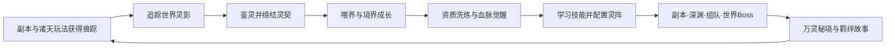

# 《诸天灵契》灵兽玩法全面重制设计文档

> 文档版本：V1.0
>
> 设计状态：玩法方案稿，可进入技术接入规划与数值验证阶段
>
> 适用项目：当前 QQ 机器人回合制修仙 RPG
> 核心题材：《斗破苍穹》《仙逆》《完美世界》《遮天》《凡人修仙传》《沧元图》六界交汇

## 一、设计结论

灵兽不再是一张“抽到后提供固定百分比”的被动卡，而是与角色共同成长、能够改变战斗策略、拥有世界来历和陪伴故事的长期伙伴。

新版系统定名为 **“诸天灵契”**。玩家将在诸天裂隙中追寻兽踪、鉴定兽魂、与万灵结契，通过喂养、境界、资质、血脉、技能和羁绊六条养成线培育灵兽，并组成“一主契、两辅契”的灵阵参与副本、轮海深渊、组队和世界 Boss。

设计重点不是堆叠更多永久属性，而是让不同灵兽提供清晰的战术选择：追击、护主、回春、扰敌、破阵。任何养成材料都应有稳定免费来源，重置和换养成本足够低，避免玩家因早期选择失误而永久落后。

## 二、现有系统诊断

当前灵兽代码已经具备寻访、收藏、出战、洞府容量和 PVE 战斗快照能力，但玩法深度较浅：

1. 每日完成副本后随机获得一只灵兽，获得过程缺少探索、目标与保底。
2. 灵兽只有资质、性格、定位和一项固定灵契，`bond_exp` 尚未形成真实养成。
3. 重复灵兽没有消耗出口，收藏容量较小，长期寻访很快失去意义。
4. 玩家只能设置一只出战灵兽，没有阵容、技能顺序和副本策略。
5. 灵兽与六位主角仅存在少量本源协同，尚未形成六界题材内容。
6. 洞府灵兽园主要提供容量，没有喂养、派遣、孵化、血脉或专属产出。
7. 灵兽不能通过成长改变形态，也没有图鉴故事、羁绊事件和赛季目标。

新版将保留现有战斗快照与洞府接入思路，全面替换灵兽的获得、培养、阵容和内容循环。

## 三、参考框架与改造原则

《一念逍遥》官方公开的灵兽体系包含秘境收集、鉴定、喂养、技能、资质、血脉、境界、化形和上阵等成长层次；后续版本还加入了多灵兽灵阵、批量炼化、内丹天赋与共鸣。新版借鉴的是这种“获得—培养—觉醒—上阵”的层次感，不照搬其数值、付费结构和具体灵兽。

改造遵循以下原则：

- **题材融合而非简单换皮**：每个世界的灵兽机制应与主角专属玩法相呼应。
- **结契而非奴役**：黑皇道影、太虚幼龙等高智慧生灵以灵影、道友或守护契约出现，不描述为捕获后的所有物。
- **一只可主养，多只有用途**：主养一只即可完成核心内容，辅养灵兽用于阵容、派遣和图鉴。
- **机制强于数值**：高品质灵兽拥有更独特的触发方式，但不会仅凭稀有度形成数倍属性碾压。
- **可逆养成**：等级、境界和技能投入可以继承或返还，鼓励尝试不同组合。
- **不售卖绝版战力**：仙玉只可用于外观、改名和额外预设，不直接购买天品灵兽或血脉数值。
- **适合文字机器人**：每个页面只展示当前最重要的信息，单页按钮不超过 8 个，复杂操作采用“预览—确认”。

## 四、世界观设定

六界交汇后，轮海深处出现一座残缺的 **万灵古印**。古印能够映照诸界万灵，却无法强行拘束真实生灵。修士在副本、深渊和世界 Boss 中取得的“兽踪”，会在古印中凝成可交流的灵影。

玩家与灵影完成试炼后缔结灵契。灵兽在洞府灵兽园中修行，借主人的见闻恢复血脉记忆；主人则通过灵阵获得灵兽的战斗协助。契约双方彼此成就，不存在出售本体、随机销毁或强制吞噬。

六界分别留下不同的万灵法则：

| 世界 | 灵兽题材 | 核心关键词 | 与当前角色系统的联系 |
| --- | --- | --- | --- |
| 斗气大陆 | 魔兽、古族血脉、异火伴生 | 爆发、灼烧、吞噬 | 萧炎的异火与焚诀 |
| 仙罡星域 | 星兽、古神遗种、意境生灵 | 生死、因果、削韧 | 王林的意境与古神星点 |
| 大荒 | 太古遗种、纯血生灵、宝术符文 | 肉身、雷霆、宝术 | 石昊的洞天与六道轮回 |
| 北斗星域 | 圣兽、阵灵、太古种族灵影 | 阵纹、先机、涅槃 | 叶凡的五秘境与九秘 |
| 人界灵界 | 灵虫、异兽、神魂灵宠 | 驱邪、破器、稳健成长 | 韩立的飞剑、法宝与神识 |
| 沧元界 | 守城灵兽、雷霆生灵、元神幻兽 | 守护、极速、洞察 | 孟川的刀法、元神与绘卷 |

## 五、核心循环



### 5.1 每日循环

1. 完成当天首次完整副本，获得 1 枚“诸天兽踪”。
2. 在“灵兽寻踪”中选择一个世界，发现 3 个灵影线索之一。
3. 完成一次照料或派遣，获得御兽灵息与羁绊。
4. 使用已配置灵阵参与正常 PVE，首三场获得羁绊经验。

每日操作目标控制在 3 分钟以内，不要求玩家反复点击喂养数十次。

### 5.2 每周循环

1. 挑战六界轮换的“万灵秘境”，获得洗髓露、血脉精魄和技能残页。
2. 完成灵兽周记：结算三项自然进度，如参战、照料和派遣。
3. 根据主契灵兽的定位选择一个首领词条，形成可重复挑战的策略内容。
4. 宗门成员共同供养宗门护山灵兽，领取不影响个人排名的协作奖励。

### 5.3 长期目标

- 收集六界图鉴并阅读灵兽羁绊故事。
- 培养一只主契灵兽至真灵境，完成两次外形蜕变。
- 为每位角色建立一套世界共鸣或跨界灵阵。
- 在万灵秘境、轮海深渊和世界 Boss 中取得灵兽专属成就。
- 收集外观、称号和灵兽园布景，而不是无限叠加永久攻击。

## 六、灵兽本体结构

每只玩家灵兽由以下信息组成：

| 模块 | 作用 | 是否随机 | 是否可重置 |
| --- | --- | --- | --- |
| 灵种 | 决定名称、世界、定位、基础技能 | 否 | 不变 |
| 品质 | 灵品、玄品、地品、天品 | 灵种固定 | 可通过长期返祖升一档 |
| 等级 | 提升灵兽自身战斗属性 | 否 | 100%继承 |
| 境界 | 解锁技能槽、血脉和形态 | 否 | 100%返还通用材料 |
| 四维资质 | 灵力、体魄、神魂、迅捷 | 洗髓生成 | 预览后决定是否替换 |
| 性情 | 勇猛、沉稳、灵慧、机敏 | 初始随机 | 可通过陪伴定向改变 |
| 血脉 | 六个血脉节点与两次返祖 | 否 | 同灵种永久保留 |
| 技能 | 1天赋、1血脉、2传承技能 | 可搭配 | 可无损卸下技能书 |
| 羁绊 | 解锁故事、语音式文本和小幅协同 | 否 | 永久保留 |

### 6.1 品质定位

- **灵品**：容易获得、养成便宜，适合新手和派遣。
- **玄品**：定位完整，能够承担一种明确战术职责。
- **地品**：拥有条件触发型机制，是中后期阵容主体。
- **天品**：拥有独特世界机制，但基础数值仅比地品高约 8%—12%。

所有灵品、玄品灵兽在完成“返祖”后都可提升一档品质。初始稀有度不是永久淘汰线。

### 6.2 四维资质

- **灵力**：影响治疗、护盾和元素效果。
- **体魄**：影响灵兽生命、减伤和护主效果。
- **神魂**：影响削韧、驱散和控制抵抗。
- **迅捷**：影响协战顺序和追击触发。

资质范围为 60—100。洗髓时展示旧值、新值、总评和战斗变化，玩家发送“灵兽洗髓确认”后才替换。可锁定一项资质，锁定成本逐项增加。系统保存历史最高总评，连续 10 次未提升时，下一次至少提高 2 点总评。

### 6.3 性情

性情不直接提供常驻攻击百分比，而是决定自动战斗倾向：

- 勇猛：优先伤害与追击技能。
- 沉稳：主人低血量时保留护盾、治疗技能。
- 灵慧：优先驱散首领增益和触发元素反应。
- 机敏：优先抢先手、削速和打断蓄力。

玩家连续三天选择同类互动即可定向改变性情，避免为性情重复抽取灵兽。

## 七、首发灵兽图鉴

当前四只灵兽不会删除，统一归入“诸天通用灵种”，承担新手教学和低成本返祖路线。

### 7.1 通用灵种

| 灵兽 | 品质 | 定位 | 重制后天赋 |
| --- | --- | --- | --- |
| 赤焰灵狐 | 灵品 | 攻伐 | 主人施加灼烧后进行一次弱化追击，每场最多2次 |
| 玄甲龟 | 灵品 | 守御 | 主人首次低于50%气血时生成护盾 |
| 青木鹿 | 灵品 | 生息 | 每三回合为主人恢复少量气血并降低一层持续伤害 |
| 寒翎雀 | 灵品 | 控场 | 开场提高少量速度，首次命中后降低敌方下一回合速度 |

### 7.2 六界核心灵种

以下灵种以各作品题材为设计原型。高智慧角色只通过古印留下的友善道影结契，不将原作角色描述为可交易宠物。

| 世界 | 灵种 | 品质 | 定位 | 标志技能 | 题材联系 |
| --- | --- | --- | --- | --- | --- |
| 斗气大陆 | 紫晶翼狮 | 地品 | 攻伐 | 紫火震击：灼烧目标受到的首次追击增强 | 魔兽山脉与紫火血脉 |
| 斗气大陆 | 太虚幼龙 | 天品 | 破阵 | 虚空挪移：移除敌方一层护盾并提高本回合破甲 | 太虚古龙与空间之力 |
| 斗气大陆 | 天妖凰影 | 地品 | 控场 | 凰翼掠空：抢先手并规避一次速度压制 | 天妖凰血脉灵影 |
| 仙罡星域 | 蚊兽 | 玄品 | 控场 | 血翅噬灵：目标带减益时追加削韧 | 王林早期同行异兽题材 |
| 仙罡星域 | 雷蛙 | 地品 | 破阵 | 天雷震魂：首领蓄力时提高破局效率 | 雷霆星兽题材 |
| 仙罡星域 | 望月幼灵 | 天品 | 守御 | 古神月守：高气血时护主，低气血时转为回复 | 古神一族与望月题材 |
| 大荒 | 狻猊 | 地品 | 破阵 | 狻猊雷印：雷行伤害附加削韧 | 石昊宝术与太古遗种 |
| 大荒 | 朱厌 | 地品 | 守御 | 搬山战躯：受击后短暂提高攻防 | 朱厌宝术的刚猛肉身 |
| 大荒 | 九头狮子 | 天品 | 攻伐 | 九首齐啸：对多波战斗的下一名敌人保留战意 | 大荒纯血生灵题材 |
| 北斗星域 | 黑皇道影 | 天品 | 控场 | 无始阵纹：提前揭示一次首领机制并降低阵法伤害 | 阵纹与黑皇同行题材 |
| 北斗星域 | 龙马 | 地品 | 攻伐 | 星路奔袭：取得先手时追加一次冲击 | 星路游历与龙马题材 |
| 北斗星域 | 九变神蚕 | 天品 | 生息 | 神蚕九变：首次濒危时蜕变并回复，单场一次 | 神蚕蜕变与太古种族题材 |
| 人界灵界 | 噬金虫群 | 地品 | 破阵 | 万虫噬器：对护盾、法宝类机制额外削韧 | 韩立灵虫与破器手段 |
| 人界灵界 | 啼魂兽 | 天品 | 控场 | 啼魂镇煞：清除主人一层魂系减益并反制阴魂 | 韩立驱鬼镇魂题材 |
| 人界灵界 | 豹麟兽 | 地品 | 攻伐 | 豹麟追影：敌方气血低于30%时发动追击 | 灵界异兽与追踪题材 |
| 沧元界 | 镜湖雷隼 | 地品 | 控场 | 雷隼掠影：首回合加速，破局后重置一次追击 | 结合镜湖、雷霆和快刀的原创灵种 |
| 沧元界 | 城关玄犀 | 地品 | 守御 | 城关不退：世界 Boss 与组队中分担一次高额伤害 | 结合城关守御主题的原创灵种 |
| 沧元界 | 元神梦貘 | 天品 | 生息 | 梦境观敌：显示最高威胁并降低首次元神伤害 | 结合元神、绘卷与洞察的原创灵种 |

说明：沧元界原作的妖族主体具有独立阵营与智慧，因此首发采用与作品修炼主题相连的原创守护灵种，避免把主要敌对角色直接宠物化。

## 八、灵兽获得与重复转化

### 8.1 新手结契

完成首次副本后，玩家可从赤焰灵狐、玄甲龟、青木鹿、寒翎雀中任选一只。选择页面同时说明其战术定位，不设置隐藏最优解。

### 8.2 世界寻踪

发送“灵兽寻踪”后，玩家选择一个世界。系统展示三个线索：稳定线索、稀有线索和未知线索。

- 稳定线索：必定发现灵品或玄品，额外获得培养材料。
- 稀有线索：地品概率提高，但试炼难度更高。
- 未知线索：世界随机，可能发现天品道影或特殊羁绊事件。

选择后生成可保存的寻踪任务，不因机器人重启或重复点击改变结果。

### 8.3 鉴灵与保底

- 每枚兽魂石可鉴定一次兽魂。
- 每 10 次至少出现一只地品灵兽或地品自选精魄。
- 60 次内必定出现一只天品灵兽；提前出现后重置天品计数。
- 首次获得某世界的三只核心灵兽前启用图鉴保护，重复权重降低。
- 鉴灵只消耗玩法产出的兽魂石，不开放仙玉直接购买次数。

### 8.4 重复灵兽

重复灵兽不会占用必须保留的收藏空间。玩家可在获得时选择：

1. **结契留存**：保留为独立个体，用于不同资质、技能或派遣流派。
2. **化为精魄**：转化成对应灵种的血脉精魄。
3. **录入古印**：首次重复可提高该灵种图鉴研究等级，提供外观和故事奖励。

系统不得自动炼化地品、天品或已锁定灵兽。

## 九、养成系统

### 9.1 等级与喂养

灵兽等级不得超过当前出战角色等级。喂养消耗“御兽灵息”，支持一次喂养 1、5、10、最大数量。

洞府灵兽园每日产出的“御兽灵息”成为真实物品：

- Lv.1 每日提供基础灵息。
- 每级提高产出和派遣效率。
- Lv.4、Lv.7 分别解锁第二、第三灵阵位置。
- Lv.10 解锁一键照料和第三套灵阵预设，不提供独占战斗倍率。

### 9.2 境界

灵兽境界共七阶：幼灵、启智、凝丹、化形、返祖、真灵、太古。

每阶 10 级，突破需要灵息、同阶兽材和少量灵石。境界主要解锁功能：

| 境界 | 主要解锁 |
| --- | --- |
| 幼灵 | 天赋技能、基础喂养 |
| 启智 | 第一个传承技能槽 |
| 凝丹 | 血脉系统、灵兽第一形态变化 |
| 化形 | 辅契位置效果、第二传承技能槽 |
| 返祖 | 灵种返祖、品质提升资格 |
| 真灵 | 世界共鸣强化、第二形态变化 |
| 太古 | 终局外观、专属羁绊结局，不继续无限升阶 |

境界突破不采用失败掉级。材料满足后必定成功，稀缺性由周产出和境界条件控制。

### 9.3 血脉觉醒

每只灵兽拥有六个固定血脉节点。激活节点消耗同灵种精魄和通用血脉精华：

1. 血脉初鸣：强化天赋技能的基础机制。
2. 灵纹显化：获得一项生存属性。
3. 古血苏醒：解锁血脉技能。
4. 真形蜕变：改变外形描述与战斗登场文本。
5. 万灵共鸣：强化世界或五行共鸣。
6. 返祖归真：解锁最终机制，不提供无限数值成长。

节点进度属于“灵种”，同名灵兽共享，避免玩家换个体后重复投入。

### 9.4 技能系统

每只灵兽最多配置四个技能：

- 1 个天赋技能：灵种固定。
- 1 个血脉技能：血脉第三节点解锁。
- 2 个传承技能：玩家自由配置。

传承技能分为攻伐、守御、生息、控场、破阵五类。技能书使用后进入玩家“灵契书库”，可在灵兽之间无损装卸，不会因覆盖技能而销毁。

技能有明确冷却和每场触发上限，不使用低概率秒杀、无限控制或随机复活。自动战斗按照玩家设置的优先级释放。

### 9.5 羁绊与故事

羁绊通过真实陪伴获得：每天首次照料、前三场 PVE、世界寻踪事件和灵兽专属试炼。重复喂丹不能无限刷羁绊。

羁绊共 10 级：

- 2、4、6、8 级解锁灵兽故事章节。
- 5 级解锁自定义昵称和灵兽问候文本。
- 7 级解锁专属入场描述。
- 10 级解锁纪念外观与“生死与共”协同，战斗数值上限为 3%。

## 十、灵阵与战斗规则

### 10.1 三个灵阵位置

| 位置 | 数量 | 战斗职责 |
| --- | --- | --- |
| 主契 | 1 | 实际协战，自动释放天赋、血脉和传承技能 |
| 护契 | 1 | 提供一次守御、生息或抗性触发 |
| 辅契 | 1 | 提供开场、破局或世界共鸣效果 |

主契灵兽在主人行动后进行协战，不额外要求玩家每回合发送一条灵兽指令。护契与辅契只按条件触发，避免战报过长。

### 10.2 灵兽生存

主契拥有独立“灵体值”，但不作为普通单体技能的默认目标。Boss 范围机制、反击和特定破阵失败会损伤灵体值。灵体归零后该灵兽本场退阵，主人仍可继续战斗。

该规则让守御与生息型灵兽有价值，同时避免灵兽替主人无条件承受全部伤害。

### 10.3 世界共鸣

同一世界上阵 2 只灵兽时激活基础共鸣，3 只时强化其机制；共鸣以玩法特性为主：

| 世界 | 两灵共鸣 | 三灵共鸣 |
| --- | --- | --- |
| 斗气大陆 | 首次灼烧延长1回合 | 首次吞噬或驱散后追加紫火追击 |
| 仙罡星域 | 首个减益的削韧提高 | 主人濒危时触发生死轮转，每场一次 |
| 大荒 | 宝术类协战获得战意 | 三层战意可使下次灵兽技能攻守换形 |
| 北斗星域 | 首次首领机制获得阵纹提示 | 成功破局后为主人生成小额屏障 |
| 人界灵界 | 对护盾、器物和魂系机制效果提高 | 首次驱散成功后缩短主契冷却1回合 |
| 沧元界 | 开场显示最高威胁倾向 | 完成破局后记录刀痕，下一波保留一次增益 |

### 10.4 混合灵阵

不希望组同世界阵容的玩家可以使用“五行灵阵”：三个位置不存在重复元素时，获得均衡共鸣——攻击、防御、治疗和速度效果各自提高少量，但不解锁世界专属机制。

世界共鸣与五行共鸣强度应接近，让题材收藏与自由搭配都能成立。

### 10.5 角色专属协同

当出战角色与主契来自同一世界时，解锁一条有边界的专属协同：

- 萧炎：灵兽首次触发火系追击时，延长当前灼烧1回合。
- 王林：灵兽首次施加减益时，额外削减少量韧性。
- 石昊：宝术类技能触发后，主契获得1层战意。
- 叶凡：灵兽阵纹提示与“前字秘”的威胁提示合并展示，不重复叠加。
- 韩立：噬金、镇魂类灵兽对护盾或魂系机制提高破局效率。
- 孟川：首回合成功抢得先手后，主契协战一次，但伤害受固定上限限制。

协同属于策略标签，单项战斗收益不超过约 5%，不会迫使玩家只能使用同世界灵兽。

### 10.6 全局数值上限

灵兽对主人提供的同类效果统一封顶：

- 常驻攻击、常驻防御、常驻速度：各不超过 12%。
- 单次治疗：不超过主人最大气血的 8%。
- 单次护盾：不超过主人最大气血的 10%。
- Boss 增伤和削韧效率：各不超过 10%。
- 复苏、濒危回复和强驱散：每场最多 1 次。

灵兽自身数值独立计算，不写回角色永久基础属性。

## 十一、现有玩法接入

### 11.1 普通副本与扫荡

- 正常挑战会冻结整套灵阵快照，战斗中不读取实时养成数据。
- 完整通关每日首次掉落诸天兽踪。
- 扫荡只结算基础兽材，不结算羁绊和专属故事事件，保留手动挑战价值。

### 11.2 轮海深渊

- 开始一层时冻结灵阵，层内不能换阵。
- 主契灵体值在怪物之间恢复 30%，与角色生命继承规则一致。
- 深渊每波战斗使灵兽获得少量羁绊，但每日设置总上限。
- 特定层可出现“兽心试炼”，成功后临时强化一个灵兽技能，仅本层有效。

### 11.3 组队战斗

- 每名玩家只展示自己的主契灵兽，护契与辅契效果写入玩家快照。
- 同名灵兽的同类团队 Buff 不叠加，取最高值。
- 守御灵兽可替队友分担一次机制伤害，但不能替代队伍阵法和玩家技能。

### 11.4 世界 Boss

- 灵兽贡献分为伤害、护盾、治疗、驱散和破局，不只统计输出。
- 每场灵兽贡献加成设硬上限，避免天品灵兽放大排行榜差距。
- 每周出现一个“万灵弱点”，鼓励轮换不同定位，而不是固定唯一答案。

### 11.5 洞府与派遣

未上阵灵兽可以执行 4—12 小时派遣：巡山、采药、探矿、寻迹。派遣产出以灵兽材料为主，少量连接药园与炼器资源。

派遣只判断世界、定位和境界，不要求极限战力。已派遣灵兽不能临时上阵，取消派遣会按已完成时间结算，不没收全部收益。

### 11.6 宗门玩法

宗门研究可解锁“御兽学”分支：提高宗门护山灵兽的协作收益、增加万灵秘境挑战次数或提供追赶材料。宗门研究不得直接增加个人灵兽永久攻击。

## 十二、专属内容

### 12.1 万灵秘境

每周开放两个世界主题，玩家从三条路线选择一条：

- 血脉路线：Boss 更强，主要产出血脉精华。
- 技能路线：包含机制谜题，主要产出灵契残页。
- 羁绊路线：难度较低，主要产出故事道具和外观碎片。

每周首次失败不消耗次数，允许玩家根据战报调整灵阵。

### 12.2 灵兽传记

每只核心灵兽拥有四章文本事件：初见、同行、抉择、归真。事件包含 2—3 个按钮选项，不用“正确答案”惩罚玩家；选择改变后续对话和纪念称号，不改变核心战斗数值。

### 12.3 灵兽切磋

玩家可发送“灵兽切磋 @玩家”进行无奖励友谊战。系统使用独立的标准化属性，只比较阵容机制和技能顺序，不消耗资源，不纳入强制日常。

正式竞技赛季应在 PVE 版本稳定后再开放，并采用分段属性压缩，避免养成差距直接决定胜负。

## 十三、资源与经济

### 13.1 核心资源

| 资源 | 用途 | 主要来源 | 是否可交易 |
| --- | --- | --- | --- |
| 诸天兽踪 | 开启世界寻踪 | 每日首次副本、活动 | 否 |
| 兽魂石 | 鉴灵 | 万灵秘境、世界Boss、周记 | 否 |
| 御兽灵息 | 等级喂养 | 洞府灵兽园、派遣、副本 | 否 |
| 兽材 | 境界突破 | 万灵秘境、派遣、深渊 | 基础兽材可交易 |
| 洗髓露 | 洗炼资质 | 周记、秘境、宗门兑换 | 否 |
| 血脉精华 | 激活通用血脉节点 | 秘境、重复转化 | 否 |
| 灵种精魄 | 特定灵种血脉 | 重复灵兽、天品保底替代 | 否 |
| 灵契残页 | 解锁传承技能 | 技能路线、世界Boss | 否 |

### 13.2 灵石消耗建议

灵石只承担服务费和选择成本，不直接兑换天品灵兽：

- 资质洗髓：每次 500 灵石并消耗 1 洗髓露。
- 境界突破：按阶消耗 1,000、2,000、4,000、7,000、11,000、16,000 灵石。
- 技能参悟：每次 800 灵石，不销毁已解锁技能。
- 灵兽归真：每周前三次免费，之后每次 2,000 灵石。
- 灵阵额外预设：首套免费、第二套由洞府解锁；更多仅作为便利功能。

正式数值应根据线上玩家灵石中位数、每日副本净产出和商城消费率再校准，目标是主养一只灵兽不需要放弃角色核心养成。

### 13.3 付费边界

仙玉可提供：灵兽改名牌、灵兽园布景、入场文本特效、外观染色和额外阵容预设。

仙玉不得直接提供：限定战斗灵兽、血脉节点、额外每日兽踪、突破成功率、专属高数值技能。

## 十四、归真、继承与防误操作

“灵兽归真”用于换养，不等同删除：

- 返还 100% 御兽灵息和境界兽材。
- 返还已装备的全部技能，技能本身属于书库。
- 资质洗髓消耗不返还，但历史最高资质记录进入图鉴。
- 血脉进度属于灵种，不因归真丢失。
- 羁绊等级、故事和外观永久保留。

地品、天品、已命名、已锁定、羁绊 5 级以上灵兽必须二次确认。确认页必须显示返还明细，并提供“取消归真”按钮。任何批量操作默认排除这些灵兽。

## 十五、QQ 指令与消息交互

### 15.1 指令目录

| 一级入口 | 常用指令 |
| --- | --- |
| 灵兽主页 | `灵兽`、`灵兽菜单` |
| 收藏查看 | `我的灵兽`、`灵兽详情 编号`、`灵兽图鉴 世界` |
| 获得 | `灵兽寻踪`、`灵兽寻踪 世界`、`灵兽鉴定` |
| 培养 | `灵兽培养 编号`、`灵兽喂养 编号 数量`、`灵兽洗髓 编号` |
| 血脉技能 | `灵兽血脉 编号`、`灵兽技能 编号`、`灵兽技能装配 编号 技能编号 槽位` |
| 灵阵 | `灵兽阵容`、`灵兽上阵 编号 主契/护契/辅契`、`灵兽预设 编号` |
| 内容 | `万灵秘境`、`灵兽派遣`、`灵兽传记 编号` |
| 重置 | `灵兽归真 编号`、`灵兽归真确认` |

### 15.2 灵兽主页示例

```markdown
##### 🐾 诸天灵契

主契：**#12 紫晶翼狮**｜凝丹境 Lv.26
灵阵：斗气大陆 2/3｜紫火共鸣已激活
今日兽踪：1｜兽魂石：7｜御兽灵息：860

> 下一目标：血脉初鸣 3/5 精魄

<qqbot-cmd-input text='我的灵兽' show='我的灵兽' /> | <qqbot-cmd-input text='灵兽寻踪' show='今日寻踪' />

<qqbot-cmd-input text='灵兽阵容' show='配置灵阵' /> | <qqbot-cmd-input text='万灵秘境' show='万灵秘境' />

<qqbot-cmd-input text='灵兽图鉴' show='六界图鉴' /> | <qqbot-cmd-input text='洞府' show='返回洞府' />
```

对应 QQ Keyboard 保留 6 个按钮：我的灵兽、今日寻踪、配置灵阵、万灵秘境、六界图鉴、洞府。

### 15.3 灵兽列表示例

```markdown
##### 🐾 我的灵兽｜1/3

**#12 紫晶翼狮**｜地品｜凝丹26
> 攻伐·主契｜紫火血脉Ⅱ｜羁绊4

**#8 青木鹿**｜灵品｜启智18
> 生息·护契｜回春灵息｜羁绊6

**#19 镜湖雷隼**｜地品｜幼灵10
> 控场·派遣中 02:14:36

<qqbot-cmd-input text='灵兽详情 12' show='查看#12' /> | <qqbot-cmd-input text='灵兽详情 8' show='查看#8' />
```

列表只显示编号、名称、品质、境界等级、定位和状态。资质、技能、故事等信息进入详情页，避免一页堆满所有字段。

### 15.4 风险操作示例

洗髓、技能替换、归真和重复转化全部采用两步确认。确认按钮携带短期操作令牌，重复点击同一消息只会得到原结果，不会重复扣除材料。

## 十六、数据与技术边界建议

完整重写建议保留旧表作为迁移来源，新建 V2 结构后切换读写：

| 表 | 职责 |
| --- | --- |
| `spirit_beast_template` | 灵种、世界、品质、定位、元素和白名单机制码 |
| `spirit_beast_skill` | 技能目录、冷却、触发条件、数值上限 |
| `user_spirit_beast_v2` | 玩家灵兽实例、等级、境界、性情和状态 |
| `user_spirit_beast_aptitude` | 四维资质、历史最高和待确认洗髓结果 |
| `user_spirit_beast_bloodline` | 按灵种保存血脉节点与精魄 |
| `user_spirit_beast_skill_book` | 玩家永久技能书库 |
| `user_spirit_beast_skill_slot` | 灵兽技能装配 |
| `user_spirit_beast_formation` | 三位置、预设和乐观锁版本 |
| `user_spirit_beast_codex` | 图鉴、重复研究与故事进度 |
| `spirit_beast_trace` | 每日寻踪状态和确定性随机种子 |
| `spirit_beast_reward_ledger` | 奖励、返还、重复转化和幂等业务键 |
| `spirit_beast_dispatch` | 派遣状态与冻结收益快照 |

所有战斗效果必须使用代码白名单，不能把数据库自由文本解释为数值。建立战斗时冻结灵阵、等级、技能、血脉和共鸣快照；已开始的战斗不受中途换阵影响。

获得、洗髓确认、血脉激活、技能装配、归真和奖励领取均需在同一数据库事务内完成。每项消耗操作使用 QQ 消息 ID 或业务请求 ID 防重复。

## 十七、旧数据迁移方案

1. 赤焰灵狐、玄甲龟、青木鹿、寒翎雀保留原实例 ID，映射为四只通用灵种。
2. 旧资质 70—95 转换为四维资质总评，并保证转换后的战斗收益不低于旧灵契。
3. `bond_exp` 转换为新版羁绊经验，不清零。
4. 当前出战灵兽自动进入主契位；护契和辅契保持空位，等待玩家自行配置。
5. 旧灵兽数量超过新版容量时全部保留，只暂停继续鉴灵，不强制删除。
6. 每只迁移灵兽获得“初代灵契”纪念标记；该标记只提供展示，不提供绝版战力。
7. 上线首周开放无限次免费归真和阵容调整，第二周再恢复常规次数。
8. 上线前生成迁移预览报表，核对玩家灵兽数量、出战状态、资质区间和重复实例。

## 十八、开发阶段建议

### 阶段 A：核心重构

- V2 数据表、旧数据迁移、灵兽详情和新手四选一。
- 等级、境界、资质、归真与材料账本。
- 一主契战斗快照，先替换当前固定 Buff。

验收标准：旧玩家资产完整；所有消耗可追溯；重复请求不重复扣款；普通副本、深渊可恢复灵兽快照。

### 阶段 B：六界内容

- 18 只六界灵兽、世界寻踪、鉴灵保底和重复转化。
- 血脉、传承技能、羁绊故事。
- 灵兽图鉴与紧凑 QQ 菜单。

验收标准：每个世界至少覆盖三种战术定位；没有只能通过仙玉获得的战斗灵兽；图鉴保底可验证。

### 阶段 C：灵阵与专属玩法

- 一主两辅灵阵、世界共鸣、五行共鸣和六角色协同。
- 万灵秘境、洞府派遣、组队与世界 Boss 接入。

验收标准：灵阵同类效果遵守硬上限；组队同名 Buff 不叠加；手动挑战比扫荡多羁绊但不产生悬殊资源差。

### 阶段 D：长期运营

- 宗门护山灵兽、赛季外观、灵兽切磋和排行榜。
- 基于线上数据调整材料投放，不新增更高永久品质。

验收标准：主养玩家和多养玩家都有目标；新玩家存在追赶机制；赛季结束不遗留无限叠加战力。

## 十九、测试与数值验收

必须覆盖以下测试：

- 鉴灵概率、10次地品保护、60次天品保底和并发请求。
- 洗髓预览不扣错材料，确认令牌只能使用一次。
- 等级继承、归真返还、血脉共享和技能无损卸下。
- 灵阵同一位置唯一、同名 Buff 取最高、全局效果封顶。
- 普通副本、深渊、组队、世界 Boss 的快照冻结与重启恢复。
- 派遣取消、到期领取和重复领取的幂等性。
- 旧数据迁移前后灵兽数量、出战状态、资质收益和羁绊经验守恒。
- Markdown 单页长度、按钮数量和所有文本交互指令可被解析器正确保留参数。

首轮数值目标：

- 新玩家 1 天获得首只灵兽，7 天形成一主一辅。
- 活跃玩家约 2 周将主契培养至凝丹，8—10 周完成一只真灵核心养成。
- 地品合理培养后能达到同定位天品约 90% 的战斗表现。
- 灵兽体系使同层 PVE 通关效率提高约 10%—20%，不得直接跨越多个副本等级。
- 每日灵兽操作不超过 3 分钟，每周专属玩法不超过 20 分钟。

## 二十、风险与约束

1. **IP 风险**：项目若面向商业运营，应确认六部作品角色、灵兽名称和剧情元素的授权范围。未获授权时，可保留机制与世界气质，替换为原创名称和故事。
2. **系统膨胀**：首发不应同时上线繁育、自由交易和正式 PVP，优先保证主养闭环与战斗稳定。
3. **战报过长**：辅契触发合并为一段“灵阵响应”，相同持续效果只在首次生效和消失时提示。
4. **数值失控**：所有灵兽增益通过机器码白名单和统一上限进入战斗，禁止数据库自由配置绕过上限。
5. **重复劳动**：喂养、派遣领取、炼化和归真必须支持批量操作，但高价值灵兽默认受保护。
6. **老玩家损失**：迁移必须以“不删灵兽、不降旧收益、允许免费换养”为上线红线。

## 二十一、参考资料

- [《一念逍遥》官方：洞府与灵兽园介绍](https://xian.leiting.com/news/3.html)
- [《一念逍遥》官方：灵兽系统界面、血脉与灵阵优化](https://xian.leiting.com/news/702.html)
- [《一念逍遥》官方：灵兽化形三阶与养成结构](https://xian.leiting.com/news/787.html)
- [《一念逍遥》官方：灵兽内丹、丹纹天赋与共鸣](https://xian.leiting.com/news/849.html)
- 当前项目实现参考：`Game_main/g12_spirit_beast.py`、`Game_main/g14_estate.py`、`Tool/combat_system.py`、`数据库源文件/p1_spirit_beast.sql`

---

本设计的最终目标，是让玩家提起自己的灵兽时，首先想到的是“它来自哪里、如何与我并肩作战、我们经历过什么”，其次才是它增加了多少战力。
